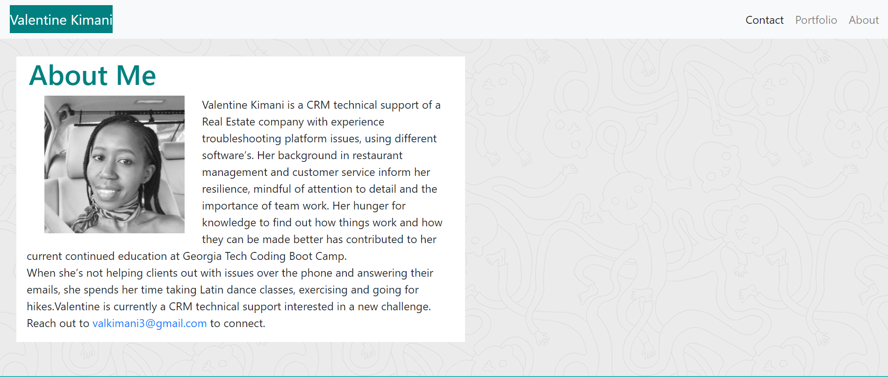
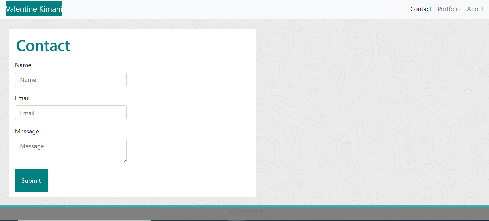
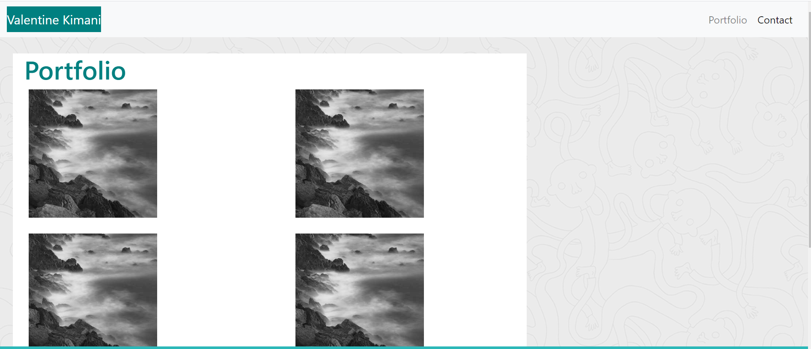

# ValentineKimani-portfolio

<!--Added a description of the refactor project-->

# Description

This is a Responsive design project. Screenshots were provided as a reference, The task is to ensure that all web applications render well on a variety of devices and window or screen sizes.

##

To achieve this, Bootstrap CSS Framework has been used to create a mobile responsive portfolio using the following:
as stated below.

- I created `index.html`, `portfolio.html` and `contact.html` files to build the code in.
- Added a navbar to the header to accomodate html links. When reduced, the nav bar reduces with the screen while acccomodating the links.
- To achievce the responseive layout, media quesrries were used as well as the bootstrap grid system (containers, rows, and columns) .
- Width and display properties were used to make the images more responsive.

# To validate the code was working a per the refernec provided,

- An HTML validation service was used to ensure that each page has valid HTML.
- When the screen size is adjusted, content on an `xs` screen takes up the entire screen. On `sm` and larger screens has some margins on the left and right sides of the screen.
- When the links are clicked, the load the responsive pages.
- Semantic elements like <nav></nav> were used to replace div elements.

- Screenshot

- Link to deployed app
  To access the project, please use the links below.

Deployed site : https://valkimani.github.io/ValentineKimani-portfolio/

https://github.com/Valkimani/ValentineKimani-portfolio

- Credits:
  https://developer.mozilla.org/en-US/docs/Glossary/Semantics

  © 2019 Trilogy Education Services, a 2U, Inc. brand. All Rights Reserved.

- Lincense

MIT License

Copyright (c) [2020] [Valentine Kimani]

Permission is hereby granted, free of charge, to any person obtaining a copy
of this software and associated documentation files (the "Software"), to deal
in the Software without restriction, including without limitation the rights
to use, copy, modify, merge, publish, distribute, sublicense, and/or sell
copies of the Software, and to permit persons to whom the Software is
furnished to do so, subject to the following conditions:

The above copyright notice and this permission notice shall be included in all
copies or substantial portions of the Software.

THE SOFTWARE IS PROVIDED "AS IS", WITHOUT WARRANTY OF ANY KIND, EXPRESS OR
IMPLIED, INCLUDING BUT NOT LIMITED TO THE WARRANTIES OF MERCHANTABILITY,
FITNESS FOR A PARTICULAR PURPOSE AND NONINFRINGEMENT. IN NO EVENT SHALL THE
AUTHORS OR COPYRIGHT HOLDERS BE LIABLE FOR ANY CLAIM, DAMAGES OR OTHER
LIABILITY, WHETHER IN AN ACTION OF CONTRACT, TORT OR OTHERWISE, ARISING FROM,
OUT OF OR IN CONNECTION WITH THE SOFTWARE OR THE USE OR OTHER DEALINGS IN THE
SOFTWARE.
